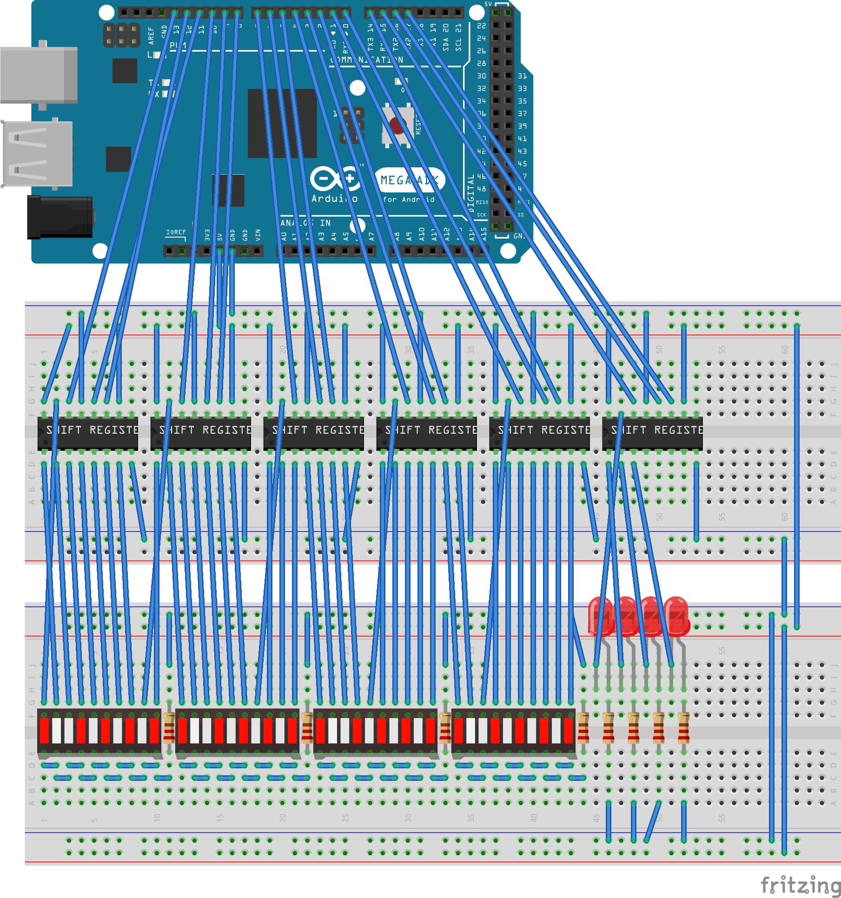

# venkman

Sound and lighting rig for a cosplay proton pack and neutrona wand.

This is just the electronics - not the chassis. Very early days.

## Bill of goods

- Arduino, probably a Uno
- DFPlayer Mini (MP3 module)]
- CF
- 4x 10 bar LED modules - blue
- 4x red LEDs
- 8x 220 ohm resistors
- 2x 1k ohm resistors
- 6x 8 bit shift registers (SN74HC595N)
- 9v battery clip
- switches
- probably a parallel to serial register (CD4021B)
	- or could use a range of resistors on an analog input
- perfboard
- wires lots of wires

## Sketchy control flow (WIP)

1. power on, cyclotron idles slowly, red light and wand meter light up
2. if you turn arm on without the generator you get an alert
3. discharge triggers vent sound effect (momentary) when cyclotron is off
4. turn generator on, cyclotron speeds up, white light on wand, generator sound, meter goes up
5. then arm, sound effect, white light in wand box
6. discharge triggers sound effect, meter goes down, white light on wand flickers
7. release triggers sound effect and meter keeps going up
8. continue firing until meter zeros out and it does the clunk effect
9. after it is over-discharged, the cyclotron stops, the meter stops going up, and it only does the clunk effect on discharge
10. need to disarm then rearm to reengage the cyclotron
